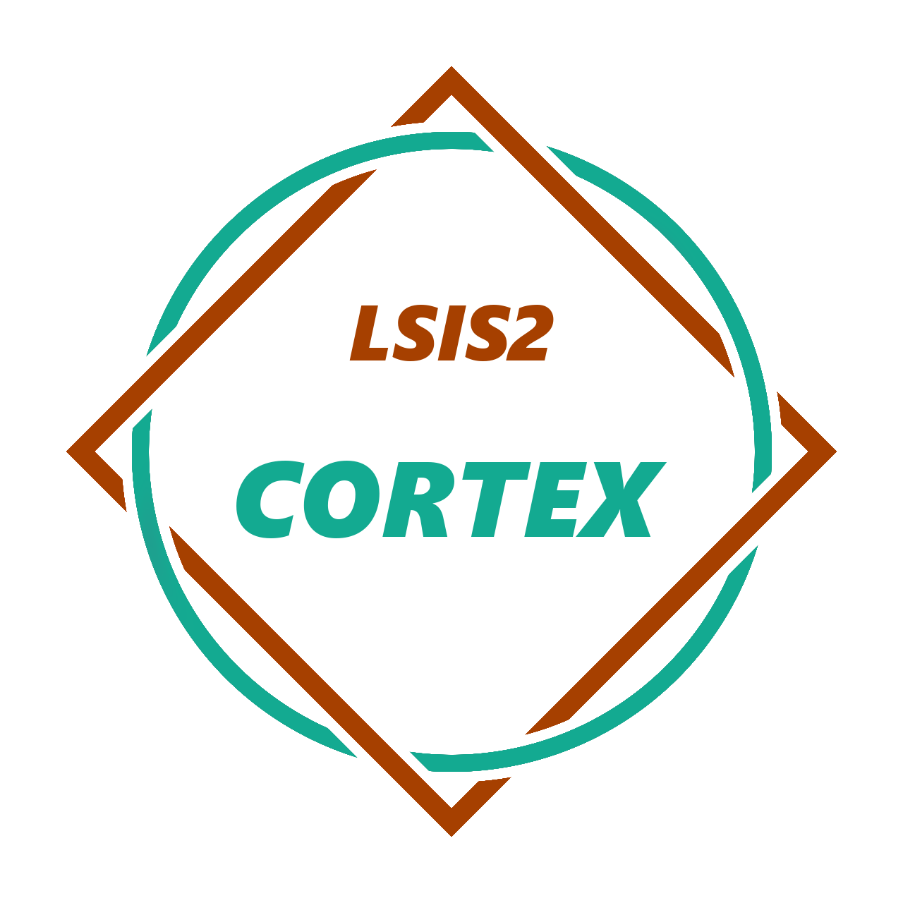

<p align="center">
  
</p>

<h1 align="center">Online-Reality</h1>

## About

[OnlineReality.xyz](OnlineReality.xyz) is a game platform built with the premisse of Joining the Two Worlds.
The Online Reality project started within the scope of the LSIS2 (Systems Labs II) class, a curricular unity of the [Systems Engineering](https://www.ipp.pt/education/courses/degree/isep/126) bachelor.

### To be considered

All game assets, under `src/game` have been removed due to Github 100MB file limit. As such, when building the project, do not forget to **ADD** the game back again.

## Introduction

This project has been designed by taking advantage of the following main technologies:
- **HTML5**
- **CSS**
- **JavaScript**
- **Docker**
- **PHP**
- **Helm 3**

## Prerequisites

- Python 3
- Docker
- Helm 3

## Run it locally

```shell
# Clone the repo:
git clone https://github.com/joaoss35/cortex.git
cd cortex/src
# Launching the Web Server
python3 -m http.server 3000
```

## Actions CI

To be added.

## Special Mentions

@Sothatsit for the amazing template client being used of his "The Royal Game of Ur".
